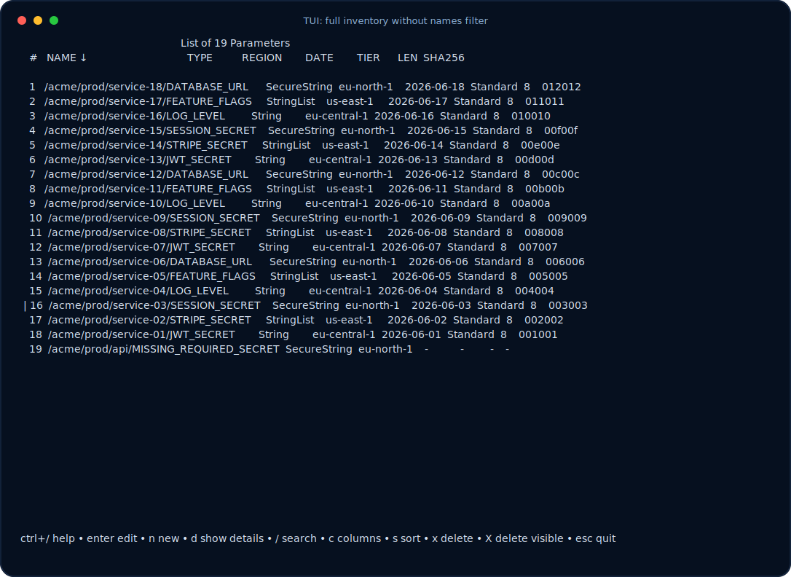

# aws-ssm-params

Terminal UI and automation-friendly CLI for AWS Systems Manager Parameter Store.

`aws-ssm-params` helps you inspect, filter, edit, import, and export SSM parameters across one or many AWS regions. It is designed for two workflows:

- **interactive maintenance** with a fast TUI for auditing, editing, creating, deleting, sorting, and searching parameters;
- **scriptable automation** with stable stdout formats for backup, migration, CI/CD, and environment generation.

<p align="center">
  
</p>

## Table of contents

- [Features](#features)
- [Installation](#installation)
- [AWS credentials and regions](#aws-credentials-and-regions)
- [Quick start](#quick-start)
- [Command overview](#command-overview)
- [Global options](#global-options)
- [Fields](#fields)
- [Filtering](#filtering)
- [SecureString values](#securestring-values)
- [Command: `tui`](#command-tui)
- [Command: `export`](#command-export)
- [Command: `import`](#command-import)
- [Input and output formats](#input-and-output-formats)
- [Sorting](#sorting)
- [Logging and diagnostics](#logging-and-diagnostics)
- [Common scenarios](#common-scenarios)
- [Shell completion](#shell-completion)
- [Development](#development)
- [Release process](#release-process)
- [License](#license)

## Features

- Browse SSM parameters in a terminal UI.
- Discover parameters from AWS or provide an explicit inventory through stdin.
- Work with one region, several regions, or all enabled regions.
- Filter by name/path, region, type, tier, data type, description, policies, and value.
- Use SSM-aware glob and extglob patterns such as `/prod/**` and `/prod/@(api|worker)/*`.
- Export to dotenv, JSON, or YAML.
- Import from dotenv, JSON, or YAML.
- Rename fields during import/export with `--map-field`.
- Export scalar values for scripts.
- Keep stdout clean for automation; logs go to stderr.
- Avoid showing SecureString values by default.
- Generate random values, load values from files, and write values to files from the TUI.
- Delete one selected parameter or all visible filtered parameters from the TUI.
- Publish release binaries and update the Homebrew formula through GoReleaser.

## Installation

### Homebrew

```bash
brew install biptec/tools/aws-ssm-params
```

Or tap the repository first:

```bash
brew tap biptec/tools
brew install aws-ssm-params
```

### Download a release binary

Download the archive for your OS and architecture from the GitHub Releases page, unpack it, and place the `aws-ssm-params` binary on your `PATH`.

Typical release assets include Linux, macOS, and Windows builds:

```text
aws-ssm-params-vX.Y.Z-linux-amd64.tar.gz
aws-ssm-params-vX.Y.Z-linux-arm64.tar.gz
aws-ssm-params-vX.Y.Z-darwin-amd64.tar.gz
aws-ssm-params-vX.Y.Z-darwin-arm64.tar.gz
aws-ssm-params-vX.Y.Z-windows-amd64.zip
aws-ssm-params-vX.Y.Z-windows-arm64.zip
checksums.txt
```

### Build from source

Go 1.24 or newer is required.

```bash
git clone https://github.com/biptec/aws-ssm-params.git
cd aws-ssm-params
go build -o aws-ssm-params ./cmd/aws-ssm-params
```

## AWS credentials and regions

The tool uses the AWS SDK for Go. AWS CLI is not required at runtime, but the same common credential sources are supported: environment credentials, shared config/profile files, SSO profiles, web identity, and instance metadata.

Choose an AWS profile with:

```bash
aws-ssm-params --profile production tui
```

Or use the matching tool-specific environment variable. It has priority over the native AWS alias:

```bash
AWS_SSM_PARAMS_PROFILE=production aws-ssm-params export --format json
AWS_PROFILE=production aws-ssm-params export --format json
```

Region resolution works like this:

1. `--region` if provided.
2. `AWS_SSM_PARAMS_REGION`.
3. `AWS_REGION`.
4. `AWS_DEFAULT_REGION`.
5. Region from the selected AWS profile.

Use `--all-regions` when you want to query all enabled AWS regions:

```bash
aws-ssm-params --profile production --all-regions tui
```

`--region` and `--all-regions` are mutually exclusive.

## Quick start

Open the TUI in one region:

```bash
aws-ssm-params --region eu-north-1 tui
```

Open the TUI across two regions:

```bash
aws-ssm-params --region eu-north-1 --region eu-central-1 tui
```

Show only production application parameters:

```bash
aws-ssm-params \
  --region eu-north-1 \
  --filter 'name:/app/prod/**' \
  tui
```

Export parameters as dotenv:

```bash
aws-ssm-params \
  --region eu-north-1 \
  --filter 'name:/app/prod/**' \
  export > prod.env
```

Export decrypted values as JSON:

```bash
aws-ssm-params \
  --region eu-north-1 \
  --filter 'name:/app/prod/**' \
  export \
  --with-decryption \
  --format json > prod-params.json
```

Import a `.env` file under an SSM root path:

```bash
aws-ssm-params \
  --region eu-north-1 \
  import \
  --format dotenv \
  --root-path /app/prod \
  --summary < .env
```

Print one decrypted value for a script:

```bash
aws-ssm-params \
  --region eu-north-1 \
  --filter 'name:/app/prod/api/token' \
  export \
  --with-decryption \
  --output-field value \
  --scalar
```

## Command overview

```text
aws-ssm-params [global options] <command> [command options]
```

Available commands:

| Command | Purpose |
| --- | --- |
| `tui` | Open the interactive terminal UI. |
| `export` | Export parameter records or scalar values to stdout. |
| `import` | Import parameter records from stdin. |

There are no separate `get` or `put` commands. Use:

- `export --output-field value --scalar` to read one value;
- `import` to create or update values;
- `tui` for manual editing.

Global options can be written before or after the command name:

```bash
aws-ssm-params --region eu-north-1 export
aws-ssm-params export --region eu-north-1
```

Repeated CLI flags must be repeated as separate arguments:

```bash
aws-ssm-params --region eu-north-1 --region eu-central-1 export
```

Do not pass comma-separated values on the command line:

```bash
# Not supported on the CLI
aws-ssm-params --region eu-north-1,eu-central-1 export
```

Comma-separated values are accepted in list-style environment variables:

```bash
AWS_SSM_PARAMS_REGION=eu-north-1,eu-central-1 aws-ssm-params export
```

## Global options

Global options apply to all commands.

| Flag | Environment | Description | Use when |
| --- | --- | --- | --- |
| `--region value` | `AWS_SSM_PARAMS_REGION`, `AWS_REGION` | AWS region. Repeat for multiple regions. The tool-specific env var has priority over the native AWS alias. | You know the exact region or want a controlled multi-region scan. |
| `--all-regions` | `AWS_SSM_PARAMS_ALL_REGIONS` | Query all enabled AWS regions. | You are auditing an account and do not know where parameters exist. |
| `--profile value` | `AWS_SSM_PARAMS_PROFILE`, `AWS_PROFILE` | AWS profile. The tool-specific env var has priority over the native AWS alias. | You use named AWS profiles or SSO. |
| `--no-color` | `AWS_SSM_PARAMS_NO_COLOR` | Disable color output. | You are running in CI, logs, or a terminal with poor color support. |
| `--keymap emacs\|vi` | `AWS_SSM_PARAMS_KEYMAP` | TUI/editor navigation style. Default is `emacs`. | You prefer vi-style TUI navigation and editing. |
| `--log-level value` | `AWS_SSM_PARAMS_LOG_LEVEL` | `trace`, `debug`, `info`, `warn`, `error`, or `off`. Default is `off`. | You need diagnostics without polluting stdout. |
| `--filters-file path` | `AWS_SSM_PARAMS_FILTER_FILE` | Load filter groups from a file. | You have many reusable filter groups. |
| `--filter value` | `AWS_SSM_PARAMS_FILTER` | Add one filter group. Repeat for OR logic. | You want to limit loaded, exported, imported, or displayed parameters. |

## Fields

Many commands use field names for filtering, sorting, output selection, field mapping, and display columns.

Common fields:

| Field | Meaning |
| --- | --- |
| `name` | SSM parameter name/path, for example `/app/prod/api/token`. |
| `region` | AWS region. |
| `type` | SSM parameter type: `String`, `StringList`, or `SecureString`. |
| `tier` | SSM tier: `Standard`, `Advanced`, or `Intelligent-Tiering`. |
| `data-type` | SSM data type, usually `text`. Aliases: `datatype`, `data_type`. |
| `policies` | Advanced parameter policies JSON. |
| `description` | Parameter description. |
| `value` | Parameter value. SecureString values are hidden unless decrypted. |
| `date` | Last modified date. Aliases: `modified`, `last-modified-date`. |
| `version` | SSM parameter version. |
| `len` | Value length. Alias: `length`. |
| `sha256` | SHA-256 hash of the value. Alias: `hash`. |
| `user` | Last modified user/ARN when available. |

Use these names consistently in `--filter`, `--output-field`, `--map-field`, and `--sort-by`.

## Filtering

Filters reduce what the command loads, displays, exports, or imports.

A filter condition has this form:

```text
field:pattern
```

A bare value without `field:` is treated as a `name` filter:

```bash
aws-ssm-params --region eu-north-1 --filter '/app/prod/**' export
```

The same command written explicitly:

```bash
aws-ssm-params --region eu-north-1 --filter 'name:/app/prod/**' export
```

### AND and OR logic

Conditions inside one `--filter` value are separated by semicolons and are combined with AND:

```bash
aws-ssm-params \
  --region eu-north-1 \
  --filter 'name:/app/prod/**;type:SecureString' \
  export
```

Repeated `--filter` flags are OR groups:

```bash
aws-ssm-params \
  --region eu-north-1 \
  --filter 'name:/app/prod/**;type:SecureString' \
  --filter 'name:/shared/prod/**;type:SecureString' \
  export
```

This means:

```text
(name matches /app/prod/** AND type is SecureString)
OR
(name matches /shared/prod/** AND type is SecureString)
```

### Filter files

Use `--filters-file` for reusable filter groups. Each non-empty, non-comment line is one OR group.

```text
# production secrets
name:/app/prod/**;type:SecureString
name:/shared/prod/**;type:SecureString

# selected public config
name:/app/prod/public/**;type:String
```

Run with:

```bash
aws-ssm-params --region eu-north-1 --filters-file filters.txt export
```

### Supported filter fields

| Field | Notes |
| --- | --- |
| `name`, `path` | SSM path/name. `path` is an alias for `name`. |
| `region` | Useful with multi-region or all-region scans. |
| `type` | `String`, `StringList`, `SecureString`. |
| `tier` | `Standard`, `Advanced`, `Intelligent-Tiering`. |
| `data-type`, `datatype`, `data_type` | Usually `text`. |
| `description` | Local match after metadata is loaded. |
| `policies` | Local match after metadata is loaded. |
| `value` | Requires values to be loaded; for SecureString, use `--with-decryption` if you need real values. |

### Pattern syntax

Patterns are path-aware. A single `*` does not cross `/`; `**` is recursive.

| Pattern | Meaning |
| --- | --- |
| `*` | Match within one path segment only. |
| `**` | Match recursively and cross `/`. |
| `?` | Match one non-slash character. |
| `[abc]`, `[a-z]` | Character class. |
| `[!abc]` | Negated character class. |
| `@(a\|b)` | Match one alternative. |
| `?(a\|b)` | Match zero or one alternative. |
| `+(a\|b)` | Match one or more alternatives. |
| `*(a\|b)` | Match zero or more alternatives. |
| `!(a\|b)` | Match anything except the alternatives. |

Examples:

```bash
# One level only: /prod/db, not /prod/app/db
aws-ssm-params --filter 'name:/prod/*' export

# Recursive: /prod/db and /prod/app/db
aws-ssm-params --filter 'name:/prod/**' export

# Only app or worker branches
aws-ssm-params --filter 'name:/prod/@(app|worker)/**' export

# Exclude old and tmp branches
aws-ssm-params --filter 'name:/prod/!(old|tmp)/**' export
```

The tool sends safe prefilters to AWS when possible, then applies the exact matcher locally. For example, `name:/app/prod/**` can be optimized with a `Name BeginsWith /app/prod/` AWS filter before local extglob matching.

## SecureString values

SecureString values are **not decrypted by default**.

Without `--with-decryption`, existing SecureString values are represented as hidden/encrypted placeholders in the TUI and exports. This is safer for auditing metadata and paths.

Use `--with-decryption` only when you really need the plaintext value:

```bash
aws-ssm-params \
  --region eu-north-1 \
  --filter 'name:/app/prod/api/token' \
  export \
  --with-decryption \
  --output-field value \
  --scalar
```

In the TUI:

- existing SecureString values are hidden unless decryption is enabled;
- editing a hidden SecureString does not reveal the old value;
- if you leave the hidden value unchanged, the tool does not send a replacement value;
- if you type a new value, the new value is saved as the parameter value;
- writing SecureString values to local files asks for confirmation unless disabled with `--no-confirm-write-securestring`.

## Command: `tui`

Open the interactive terminal UI.

```bash
aws-ssm-params [global options] tui [command options]
```

Use the TUI when you want to:

- audit parameters visually;
- inspect metadata and values;
- create parameters that are missing from an expected inventory;
- edit values or metadata;
- sort and filter quickly;
- delete selected or visible filtered parameters.

### TUI options

| Flag | Environment | Description | Use when |
| --- | --- | --- | --- |
| `--with-decryption` | `AWS_SSM_PARAMS_WITH_DECRYPTION` | Decrypt SecureString values. | You need to inspect or export real secret values in the TUI. |
| `--show-column value` | `AWS_SSM_PARAMS_SHOW_COLUMN` | Optional column to show. Repeat or use comma-separated env values. | You want a denser table with selected metadata. |
| `--sort-by field:asc\|desc` | `AWS_SSM_PARAMS_SORT_BY` | Initial sort. Repeat for multi-column sort priority. | You want predictable ordering on startup. |
| `--no-confirm-overwrite-file` | `AWS_SSM_PARAMS_NO_CONFIRM_OVERWRITE_FILE` | Skip confirmation before overwriting local files from TUI actions. | You are using file actions repeatedly and accept the risk. |
| `--no-confirm-write-securestring` | `AWS_SSM_PARAMS_NO_CONFIRM_WRITE_SECURESTRING` | Skip confirmation before writing SecureString plaintext to local files. | You intentionally write secrets to local files. |
| `--no-confirm-delete-one` | `AWS_SSM_PARAMS_NO_CONFIRM_DELETE_ONE` | Skip confirmation for deleting one parameter. | Fast cleanup with known-safe filters. |
| `--no-confirm-delete-all` | `AWS_SSM_PARAMS_NO_CONFIRM_DELETE_ALL` | Skip confirmation for deleting all visible parameters. | Automation-like cleanup inside the TUI. Use carefully. |

Accepted optional columns for `--show-column`:

```text
value, type, region, date, version, tier, len, sha256, user, description
```

The index and name/path columns are always visible.

### TUI examples

Open the TUI in one region:

```bash
aws-ssm-params --region eu-north-1 tui
```

Open production parameters and show useful metadata:

```bash
aws-ssm-params \
  --region eu-north-1 \
  --filter 'name:/app/prod/**' \
  tui \
  --show-column type \
  --show-column tier \
  --show-column version \
  --show-column sha256
```

Start with a multi-column sort:

```bash
aws-ssm-params \
  --region eu-north-1 \
  tui \
  --sort-by type:asc \
  --sort-by name:asc
```

Use vi-style navigation:

```bash
aws-ssm-params --region eu-north-1 --keymap vi tui
```

Audit all enabled regions:

```bash
aws-ssm-params --profile production --all-regions tui --show-column region
```

Use an explicit expected inventory from stdin:

```bash
cat expected-params.txt | aws-ssm-params --region eu-north-1 tui
```

`expected-params.txt` is newline-based:

```text
/app/prod/api/token
/app/prod/db/password
/app/prod/public/base-url
```

Names that are missing in AWS are still shown in the TUI so they can be created.

### Main TUI shortcuts

| Shortcut | Action |
| --- | --- |
| `enter` | Edit selected parameter. |
| `n` | Create a new parameter. |
| `d` | Show or hide details. |
| `/` | Search within loaded rows. |
| `c` | Open columns popup. |
| `s` | Open sort popup. |
| `x` | Delete selected parameter. |
| `X` | Delete all visible/filtered parameters. |
| `ctrl+/` | Show context-sensitive help. |
| `esc`, `q` | Quit or go back. |

Default navigation uses Emacs-style keys: `ctrl+n`, `ctrl+p`, `ctrl+v`, `alt+v`, `alt+<`, `alt+>`. With `--keymap vi`, use `j`, `k`, `gg`, `G`, and related vi-style movement keys.

### Editor and popup actions

While editing a parameter:

| Shortcut | Action |
| --- | --- |
| `ctrl+s` | Save. |
| `alt+e` | Open value or policies actions popup. |
| `ctrl+l` | Toggle line numbers in multiline fields. |
| `esc`, `q`, `ctrl+g` | Go back or cancel. |

Value actions:

| Shortcut | Action |
| --- | --- |
| `c` | Clear value. |
| `r` | Generate random value. |
| `l` | Load value from file. |
| `w` | Write value to file. |

Random value actions:

| Shortcut | Generated value |
| --- | --- |
| `b` | Base64, 32 random bytes. |
| `x` | Hex, 32 random bytes. |
| `u` | UUID. |
| `c` | Custom-length base64. |

Parameter metadata selectors:

| Selector | Shortcuts |
| --- | --- |
| Type | `e` SecureString, `s` String, `l` StringList. |
| Tier | `i` Intelligent-Tiering, `s` Standard, `a` Advanced. |
| Data type | `t` text, `a` aws:ec2:image, `i` aws:ssm:integration. |
| Overwrite | `t` true, `f` false. |

## Command: `export`

Export parameters to stdout.

```bash
aws-ssm-params [global options] export [command options]
```

Use `export` when you want to:

- back up SSM parameters;
- generate dotenv files for local development;
- produce JSON/YAML for review or migration;
- print a single value for a script;
- audit parameter metadata across regions.

### Export options

| Flag | Environment | Description | Use when |
| --- | --- | --- | --- |
| `--output-field field` | `AWS_SSM_PARAMS_OUTPUT_FIELD` | Include one AWS field in output. Repeat for multiple fields. | You want only selected fields. |
| `--map-field aws_field:file_field` | `AWS_SSM_PARAMS_MAP_FIELD` | Rename a field in JSON/YAML/dotenv output. Repeat for multiple mappings. | You need compatibility with another file schema. |
| `--sort-by field:asc\|desc` | `AWS_SSM_PARAMS_SORT_BY` | Sort exported records. Repeat for multi-field sort. | You want stable diffs or predictable output. |
| `--with-decryption` | `AWS_SSM_PARAMS_WITH_DECRYPTION` | Decrypt SecureString values. | You need plaintext secret values. |
| `--format dotenv\|json\|yaml` | - | Output format. Default is `dotenv`. | Choose the target file format. |
| `--key-field field` | - | Write JSON/YAML as an object/map keyed by this AWS field. | You prefer object/map output instead of arrays. |
| `--scalar` | - | Write exactly one selected output field as scalar values. | You need a list of names or one value for a script. |

If no `--output-field` is provided, export includes all supported fields.

### Export examples

Back up metadata and hidden values as dotenv:

```bash
aws-ssm-params \
  --region eu-north-1 \
  --filter 'name:/app/prod/**' \
  export > prod.env
```

Back up decrypted values as JSON:

```bash
aws-ssm-params \
  --region eu-north-1 \
  --filter 'name:/app/prod/**' \
  export \
  --with-decryption \
  --format json > prod-params.json
```

Export only selected fields:

```bash
aws-ssm-params \
  --region eu-north-1 \
  --filter 'name:/app/prod/**' \
  export \
  --format json \
  --output-field name \
  --output-field type \
  --output-field tier \
  --output-field value
```

Rename fields for another system:

```bash
aws-ssm-params \
  --region eu-north-1 \
  export \
  --format json \
  --map-field name:title \
  --map-field value:text
```

Write JSON keyed by parameter name:

```bash
aws-ssm-params \
  --region eu-north-1 \
  --filter 'name:/app/prod/**' \
  export \
  --format json \
  --key-field name
```

Print all matching names, one per line:

```bash
aws-ssm-params \
  --region eu-north-1 \
  --filter 'name:/app/prod/**' \
  export \
  --output-field name \
  --scalar
```

Print one decrypted value:

```bash
aws-ssm-params \
  --region eu-north-1 \
  --filter 'name:/app/prod/api/token' \
  export \
  --with-decryption \
  --output-field value \
  --scalar
```

Export an audit view across all regions:

```bash
aws-ssm-params \
  --all-regions \
  --filter 'type:SecureString' \
  export \
  --format yaml \
  --output-field region \
  --output-field name \
  --output-field type \
  --output-field tier \
  --output-field version \
  --output-field date \
  --sort-by region:asc \
  --sort-by name:asc
```

Use `--with-decryption` only for exports that really need plaintext secrets. Without it, SecureString values stay hidden.

## Command: `import`

Import parameters from stdin.

```bash
aws-ssm-params [global options] import [command options] < input-file
```

Use `import` when you want to:

- create parameters from a dotenv, JSON, or YAML file;
- update existing parameter values;
- migrate exported parameters into another region/account;
- apply default metadata such as type, tier, description, data type, or policies;
- review each create/update interactively with `ask` policies.

### Import options

| Flag | Description | Use when |
| --- | --- | --- |
| `--map-field aws_field:file_field` | Map input file field names to AWS field names. Repeat for multiple mappings. | Your JSON/YAML uses custom keys. |
| `--format dotenv\|json\|yaml` | Input format. Default is `dotenv`. | Choose parser for stdin. |
| `--key-field field` | Treat JSON/YAML object keys as this AWS field. | Your input is keyed by name, region, or another field. |
| `--root-path path` | Prefix relative imported names with an SSM root path. | Importing `.env` keys or relative names. |
| `--on-create skip\|error\|ask` | Behavior when the parameter does not exist. | Prevent accidental new parameters or confirm them. |
| `--on-update skip\|error\|ask` | Behavior when the parameter already exists. | Prevent accidental overwrites or confirm them. |
| `--continue-on-error` | Continue after per-record failures. | Bulk imports where one bad record should not stop everything. |
| `--summary` | Print created/updated/skipped/failed counts to stderr. | You want an import report. |
| `--default-type value` | Default type: `string`, `string-list`, `secure-string`. | Input does not include `type`. |
| `--default-tier value` | Default tier: `standard`, `advanced`, `intelligent-tiering`. | Input does not include `tier`. |
| `--default-data-type value` | Default data type: `text`, `aws:ec2:image`, `aws:ssm:integration`. | Input does not include `data-type`. |
| `--default-region value` | Default region for records without region metadata. | Migrating into one explicit region. |
| `--default-description value` | Default description. | Imported records should share description text. |
| `--default-policies value` | Default policies JSON. | Creating/updating Advanced parameters with policies. |
| `--default-policies-file path` | Read default policies JSON from a file. | Policies are multiline or long. |

`import` reads from stdin. It supports one target region at a time. `--all-regions` is not supported for import, and multiple `--region` values are not supported for import.

The default import behavior is upsert:

- create missing parameters;
- update existing parameters.

Use `--on-create` and `--on-update` to change that behavior.

### Import metadata resolution

For existing parameters, metadata is resolved in this order:

```text
input record value -> cloud metadata -> default flag -> built-in default
```

For new parameters, metadata is resolved in this order:

```text
input record value -> default flag -> built-in default
```

The `value` field is always required in imported records. It is never read from AWS during import, which avoids decrypting existing SecureString values just to update metadata.

Built-in defaults:

| Field | Default |
| --- | --- |
| `type` | `SecureString` |
| `tier` | `Intelligent-Tiering` |
| `data-type` | `text` |

### Import examples

Import dotenv keys under `/app/prod`:

```bash
aws-ssm-params \
  --region eu-north-1 \
  import \
  --format dotenv \
  --root-path /app/prod \
  --summary < .env
```

Example `.env`:

```dotenv
API_TOKEN="secret"
PUBLIC_BASE_URL="https://example.com"
```

This creates or updates:

```text
/app/prod/API_TOKEN
/app/prod/PUBLIC_BASE_URL
```

Use explicit SSM paths inside dotenv comments:

```dotenv
# ssm: /app/prod/api/token
API_TOKEN="secret"

# ssm: /app/prod/public/base-url
PUBLIC_BASE_URL="https://example.com"
```

Import with safer confirmation prompts:

```bash
aws-ssm-params \
  --region eu-north-1 \
  import \
  --format dotenv \
  --root-path /app/prod \
  --on-create ask \
  --on-update ask \
  --summary < .env
```

Create only; fail if a parameter already exists:

```bash
aws-ssm-params \
  --region eu-north-1 \
  import \
  --format json \
  --on-update error \
  --summary < new-params.json
```

Update only; skip missing parameters:

```bash
aws-ssm-params \
  --region eu-north-1 \
  import \
  --format yaml \
  --on-create skip \
  --summary < updates.yaml
```

Continue after bad records but return an error at the end if any failed:

```bash
aws-ssm-params \
  --region eu-north-1 \
  import \
  --format json \
  --continue-on-error \
  --summary < params.json
```

Import records with custom JSON field names:

```bash
aws-ssm-params \
  --region eu-north-1 \
  import \
  --format json \
  --map-field name:title \
  --map-field value:text \
  --default-type secure-string < params.json
```

Apply a default description and policies file:

```bash
aws-ssm-params \
  --region eu-north-1 \
  import \
  --format yaml \
  --default-description 'Managed by aws-ssm-params' \
  --default-tier advanced \
  --default-policies-file policies.json \
  --summary < params.yaml
```

Import only selected records from a larger file:

```bash
aws-ssm-params \
  --region eu-north-1 \
  --filter 'name:/app/prod/**;type:SecureString' \
  import \
  --format json \
  --summary < all-params.json
```

For import, filters are applied after parsing the input file and before AWS writes.

## Input and output formats

### Dotenv

Dotenv is the default format for both import and export.

Exported dotenv includes SSM comments when possible:

```dotenv
# ssm: /app/prod/api/token
# type: SecureString
APP_PROD_API_TOKEN="secret"
```

During import:

- `# ssm: /absolute/path` sets the exact SSM name for the next variable;
- `# type: SecureString` can provide parameter type metadata;
- without `# ssm:`, the dotenv key always becomes a relative name;
- relative names require `--root-path`.

During export, the SSM path is converted mechanically to an uppercase dotenv key: surrounding slashes are removed and
non-alphanumeric runs become underscores. No secret-kind-specific aliases are applied.

Use dotenv for local development files, simple secret sets, and compatibility with `.env` tooling.

### JSON records

Default JSON export writes an array of records:

```json
[
  {
    "name": "/app/prod/api/token",
    "type": "SecureString",
    "value": "secret"
  }
]
```

With `--key-field name`, JSON export writes an object keyed by the selected field:

```json
{
  "/app/prod/api/token": {
    "type": "SecureString",
    "value": "secret"
  }
}
```

JSON import accepts both arrays and keyed objects. A simple keyed object can map names directly to values:

```json
{
  "/app/prod/api/token": "secret",
  "/app/prod/public/base-url": "https://example.com"
}
```

Or map names to records:

```json
{
  "/app/prod/api/token": {
    "type": "SecureString",
    "tier": "Intelligent-Tiering",
    "value": "secret"
  }
}
```

Use JSON for scripts, migrations, reviewable diffs, and structured backups.

### YAML records

YAML supports the same record model as JSON.

Array style:

```yaml
- name: /app/prod/api/token
  type: SecureString
  value: secret
```

Map style with `--key-field name`:

```yaml
/app/prod/api/token:
  type: SecureString
  value: secret
```

Use YAML for human-edited configuration and migration files.

### Field mapping

Use `--map-field` when the file uses different names than AWS fields.

Export with custom keys:

```bash
aws-ssm-params export \
  --format json \
  --map-field name:title \
  --map-field value:text
```

Import the same shape back:

```bash
aws-ssm-params import \
  --format json \
  --map-field name:title \
  --map-field value:text < params.json
```

Use `--output-field` to choose AWS fields. Use `--map-field` to rename them in files.

## Sorting

Use `--sort-by field:asc` or `--sort-by field:desc`.

```bash
aws-ssm-params export \
  --sort-by region:asc \
  --sort-by type:asc \
  --sort-by name:asc
```

Repeated sort rules are applied in priority order. Sorting uses natural comparison, so numeric parts sort in human-friendly order.

Common sort fields:

```text
name, region, type, tier, data-type, value, date, version, len, sha256, user, description
```

In the TUI, the sort popup only shows columns that are currently visible. Use `--show-column` or the columns popup if you want to sort by an optional column.

## Logging and diagnostics

Logging is disabled by default:

```bash
aws-ssm-params --log-level off export
```

Enable logs with:

```bash
aws-ssm-params --log-level debug export 2>debug.log
```

Use trace logging for low-level AWS HTTP timing diagnostics:

```bash
aws-ssm-params --log-level trace --all-regions tui 2>trace.log
```

Logs always go to stderr. Command output stays on stdout, so commands remain safe to pipe into files and scripts.

During TUI sessions:

- if stderr is redirected, logs are written immediately to the redirected target;
- if stderr is a terminal, logs are buffered and printed after the TUI exits.

SecureString values are masked in logs.

## Common scenarios

### Audit all SecureString parameters without decrypting them

```bash
aws-ssm-params \
  --all-regions \
  --filter 'type:SecureString' \
  export \
  --format yaml \
  --output-field region \
  --output-field name \
  --output-field type \
  --output-field tier \
  --output-field version \
  --output-field date \
  --sort-by region:asc \
  --sort-by name:asc
```

Use this when you want metadata without exposing secret values.

### Find old or temporary branches

```bash
aws-ssm-params \
  --region eu-north-1 \
  --filter 'name:/app/!(prod|stage)/**' \
  tui \
  --show-column type \
  --show-column date
```

Use the TUI search and delete-visible flow carefully after reviewing the filtered rows.

### Generate a local `.env` for development

```bash
aws-ssm-params \
  --region eu-north-1 \
  --filter 'name:/app/dev/**' \
  export \
  --with-decryption \
  --format dotenv > .env.local
```

Use `--with-decryption` only for trusted local environments.

### Migrate selected parameters to another region

Export from source:

```bash
aws-ssm-params \
  --region eu-north-1 \
  --filter 'name:/app/prod/**' \
  export \
  --with-decryption \
  --format json > prod-params.json
```

Import into target:

```bash
aws-ssm-params \
  --region eu-central-1 \
  import \
  --format json \
  --summary < prod-params.json
```

### Review every create/update before writing

```bash
aws-ssm-params \
  --region eu-north-1 \
  import \
  --format yaml \
  --on-create ask \
  --on-update ask \
  --summary < params.yaml
```

Use this for manual migrations and risky updates.

### Print parameter names for another command

```bash
aws-ssm-params \
  --region eu-north-1 \
  --filter 'name:/app/prod/**' \
  export \
  --output-field name \
  --scalar
```

### Compare metadata in Git-friendly output

```bash
aws-ssm-params \
  --region eu-north-1 \
  export \
  --format json \
  --output-field name \
  --output-field type \
  --output-field tier \
  --output-field data-type \
  --output-field description \
  --sort-by name:asc > ssm-metadata.json
```

This avoids decrypting values and produces stable diffs.

### Debug slow region scans

```bash
aws-ssm-params \
  --all-regions \
  --log-level trace \
  --filter 'name:/app/prod/**' \
  export \
  --format json > params.json 2>trace.log
```

Use trace logs to inspect AWS request timing while keeping exported data in `params.json`.

## Shell completion

The CLI enables shell completion through `urfave/cli`. Use the completion integration supported by your shell and CLI environment.

For ad-hoc discovery, use:

```bash
aws-ssm-params --help
aws-ssm-params tui --help
aws-ssm-params export --help
aws-ssm-params import --help
```

## Development

Install dependencies and run the local quality gate:

```bash
make install-tools
make check
```

Useful targets:

| Target | Purpose |
| --- | --- |
| `make tools` | Check required local tools. |
| `make install-tools` | Install missing development tools into `./bin`. |
| `make fix` | Format code and tidy modules. |
| `make fmt-check` | Check formatting and imports. |
| `make mod-check` | Check module tidiness. |
| `make vet` | Run `go vet`. |
| `make build` | Build the project. |
| `make test` | Run tests. |
| `make lint` | Run golangci-lint. |
| `make vuln` | Run govulncheck. |
| `make check` | Run the full quality gate. |
| `make ci-check` | Install missing tools, then run the quality gate. |

Go 1.24 or newer is required by `go.mod`.

## Release process

Releases are automated with GoReleaser.

On a `v*` tag, the release workflow:

1. runs the quality gate;
2. builds release artifacts for Linux, macOS, and Windows;
3. generates checksums;
4. creates or updates the GitHub Release;
5. publishes the Homebrew Formula to `biptec/homebrew-tools`.

The workflow uses two tokens:

| Token | Purpose |
| --- | --- |
| `GITHUB_TOKEN` | Publish the release in this repository. |
| `HOMEBREW_TAP_GITHUB_TOKEN` | Commit the updated formula to `biptec/homebrew-tools`. |

`HOMEBREW_TAP_GITHUB_TOKEN` must have write access to the tap repository. The default repository `GITHUB_TOKEN` is not enough for cross-repository Homebrew publishing.

## License

MIT License. See [LICENSE](LICENSE).
